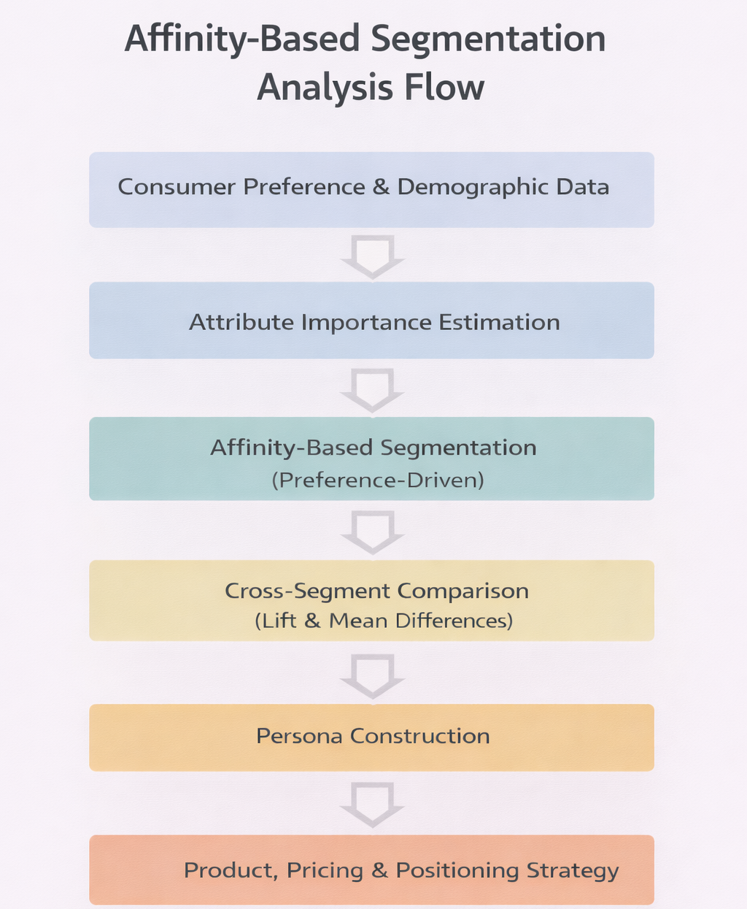

# Affinity-Based Product Segmentation & Strategy

This repository presents an end-to-end affinity-based consumer segmentation project that demonstrates how preference data can be translated into concrete product, pricing, and positioning decisions.

The project is structured as a standalone analytics case study, focusing on segmentation, interpretation, and strategic implications rather than academic exposition. It showcases how segmentation can be used not just to describe customers, but to validate and stress-test product strategy.

---

## Problem Context

An initial product optimization exercise identified the following configuration as a profit-maximizing product:

> $30 | 3-hour insulation | 20 oz | Easy Clean | Leak Resistant

This project asks a practical follow-up question:

> *Which types of consumers actually value this product — and what does that imply for portfolio and brand strategy?*

Using affinity-based, preference-driven segmentation, the analysis identifies distinct consumer segments, compares their attribute trade-offs, and translates those insights into actionable recommendations.

---

## Analysis Flow

The analysis follows a structured, decision-oriented workflow that starts from individual consumer preferences and culminates in concrete product, pricing, and positioning recommendations.

The end-to-end flow of the analysis is illustrated below:

Each stage builds on the previous one, ensuring that segmentation and personas are directly grounded in observed preference patterns.

---

## Methodology Overview

- **Inputs:** Individual-level preference data across price, insulation, capacity, cleanability, spill resistance, brand affinity, and demographics
- **Segmentation Approach:** Affinity-based (preference-driven) segmentation
- **Evaluation Logic:**
  - Mean differences relative to the overall population
  - Lift analysis to identify over- and under-indexed attributes
- **Design Principle:** Prioritize interpretability and strategic clarity over black-box clustering
The methodology is intentionally simple, transparent, and business-facing.

---

## Segment Insights

### Segment A — Performance-Driven Quality Seekers (~40%)

 > **Best-Fit Product:** $30 | 3 hrs | 20 oz | Easy Clean | Leak Resistant

- Higher-income, older, more educated consumers
- Strong emphasis on insulation performance and leak-proof reliability
- Low price sensitivity and strong brand loyalty

**Strategic Takeaway:** This segment fully validates the premium, profit-maximizing configuration. High performance and profitability are aligned.

### Segment B — Value-Driven Pragmatists (~55%)

> **Best-Fit Product:** $10 | 1 hr | 20 oz | Fair Clean | Spill Resistant

- Younger, more price-sensitive consumers
- Focused on affordability and basic functionality
- Weak attachment to premium brands

**Strategic Takeaway:** This segment maximizes volume, not margins. It explains market share dominance without driving profitability.

### Segment C — Urban Mobility Professionals (~5%)

>**Best-Fit Product:** $30 | 3 hrs | 20 oz | Easy Clean | Leak Resistant

- Highly mobile, urban consumers
- Strong preference for cleanability, portability, and spill prevention
- Motivated by lifestyle fit rather than pure performance

**Strategic Takeaway:** Despite its small size, this segment independently reinforces the same premium configuration — for different reasons.

---

## Key Strategic Insights

- Segmentation and optimization converge on the same premium product configuration
- A single product can succeed across multiple premium mindsets (performance vs. lifestyle)
- Value segments drive scale, while premium segments drive profit

The analysis highlights the importance of portfolio balance rather than one-size-fits-all product design.

---

## Skills & Concepts Demonstrated

- Preference modeling and attribute importance analysis
- Affinity-based consumer segmentation
- Lift and mean-difference interpretation
- Persona construction
- Translating analytics into product, pricing, and positioning decisions

---

> **This repository demonstrates how segmentation can be used as a strategic tool — not just a descriptive exercise — to validate real-world product decisions.**

---
